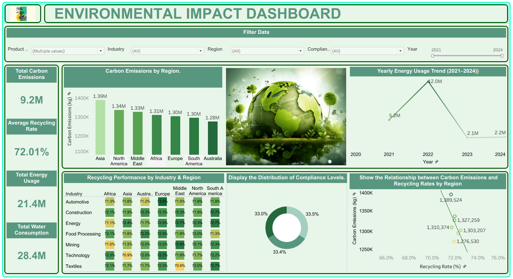

# environmental-sustainability-analysis
## Environmental Impact Dashboard: Sustainability Analysis Using Tableau
Developed a comprehensive Environmental Impact Dashboard in Tableau to analyze key sustainability indicators, including carbon emissions, energy usage, water consumption, recycling rates, waste generation, air quality, and compliance performance. The dashboard enables data-driven environmental monitoring through interactive visualizations business-focused insights.

# 🌍 Environmental Impact Dashboard

> An interactive Tableau dashboard designed to analyze environmental sustainability metrics and transform raw data into actionable insights.

---

## 📖 Project Overview

The **Environmental Impact Dashboard** is a Tableau-based analytics project that provides a comprehensive view of sustainability performance across different regions and industries.

The dashboard enables users to monitor key environmental indicators, identify trends, compare performance, and support data-driven decision-making through interactive visualizations and KPI-driven insights.

---

## 🎯 Project Objectives

* Analyze environmental sustainability performance across regions and industries.
* Monitor carbon emissions and identify high-impact areas.
* Track recycling performance and sustainability initiatives.
* Understand energy and water consumption patterns.
* Evaluate environmental compliance levels.
* Provide interactive and user-friendly data exploration.

---

## 📊 Dashboard Highlights

### 🔹 KPI Metrics

* 🌍 Total Carbon Emissions
* ⚡ Total Energy Usage
* 💧 Total Water Consumption
* ♻️ Average Recycling Rate

### 🔹 Interactive Visualizations

* 📊 Carbon Emissions by Region
* 📈 Energy Usage Trend Analysis
* ♻️ Recycling Performance Heatmap
* 🌱 Carbon Emissions vs Recycling Rate Analysis
* 🟢 Compliance Level Distribution

### 🔹 Dynamic Filters

* Region
* Industry
* Product Type
* Compliance Level
* Year

---

## 📂 Dataset Information

The project uses an **Environmental Sustainability Dataset** containing environmental performance indicators across multiple regions and industries.

### Dataset Fields

| Category               | Attributes                                                         |
| ---------------------- | ------------------------------------------------------------------ |
| Environmental Metrics  | Carbon Emissions, Energy Usage, Water Consumption, Waste Generated |
| Sustainability Metrics | Recycling Rate, Compliance Level                                   |
| Air Quality Metrics    | AQI (Air Quality Index)                                            |
| Business Dimensions    | Region, Industry, Product Type, Category, Subcategory              |
| Time Dimension         | Year                                                               |

---

## 🛠️ Tools & Technologies

| Tool                        | Purpose               |
| --------------------------- | --------------------- |
| Tableau Desktop             | Dashboard Development |
| Microsoft Excel / CSV       | Data Source           |
| Data Cleaning & Preparation | Data Transformation   |
| Data Visualization          | Insight Generation    |

---

## 🔍 Key Insights

### 🌍 Regional Analysis

* Carbon emissions vary significantly across regions.
* Some regions contribute substantially more to environmental impact.

### ⚡ Energy Consumption Trends

* Energy usage reached its highest level around 2022.
* Later years show a decline in consumption patterns.

### ♻️ Sustainability Performance

* Recycling performance remains relatively stable across industries.
* Higher recycling rates are associated with lower carbon emissions.

### 🟢 Compliance Monitoring

* Compliance levels are moderately distributed.
* Opportunities exist to strengthen sustainability initiatives.

---

## 💡 Recommendations

* Improve recycling programs in low-performing regions.
* Focus on industries with higher environmental impact.
* Encourage renewable energy adoption.
* Reduce industrial waste generation.
* Strengthen sustainability compliance practices.

---

## 📈 Business Value

This dashboard helps organizations:

✅ Monitor environmental performance

✅ Track sustainability goals

✅ Identify environmental risks

✅ Support data-driven decision-making

✅ Improve sustainability awareness

✅ Promote responsible resource management

---

## 🏆 Project Features

* Interactive Tableau Dashboard
* Sustainability Analytics
* KPI-Based Monitoring
* Dynamic Filtering System
* Trend Analysis & Performance Tracking
* Professional Dashboard Design
* Business-Oriented Insights

---

## 📸 Dashboard Screenshot

Add your dashboard image inside the repository and update the file name below:

---

## 🚀 Future Enhancements

* Real-time sustainability monitoring
* Predictive environmental analytics
* Carbon footprint forecasting
* Advanced KPI benchmarking
* Interactive storytelling dashboards

---

## ✅ Conclusion

The Environmental Impact Dashboard demonstrates how Tableau can transform complex environmental data into meaningful visual insights. By combining sustainability metrics, interactive visualizations, and KPI-driven analysis, the dashboard supports environmental monitoring, performance evaluation, and informed decision-making.

---

